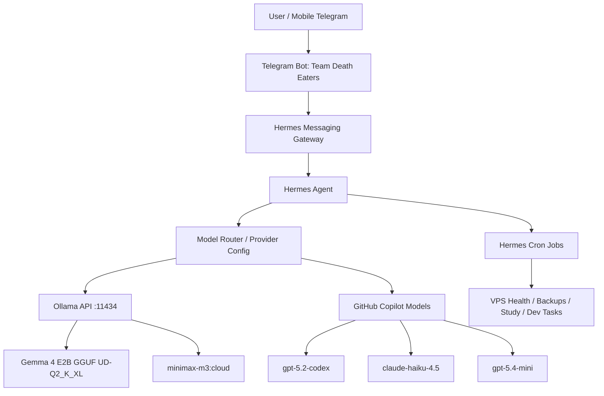

# Hermes Cloud Agent Lab


> A low-cost cloud-hosted personal AI agent stack using **AWS EC2**, **Hermes Agent**, **Telegram Gateway**, **Ollama**, local **Gemma 4 E2B GGUF**, and cloud model backends such as **minimax-m3:cloud**, **GitHub Copilot GPT-5.2 Codex**, **Claude Haiku 4.5**, and **GPT-5.4 Mini**.

This project documents and packages my personal cloud AI agent setup into a reproducible portfolio project.

## Project Codename

**Team Death Eaters** — Telegram-based command center for daily automation, development assistance, security-lab workflows, VPS monitoring, and scheduled repetitive jobs.

---

## What This Project Does

This project turns a small AWS EC2 instance into a cloud-hosted personal AI operations agent.

Core capabilities:

- Chat with the agent from Telegram.
- Run Hermes Agent from a VPS.
- Use multiple model backends depending on task type.
- Use Ollama for local/cloud model access.
- Use Gemma 4 E2B GGUF locally through Ollama.
- Use `minimax-m3:cloud` through Ollama Cloud for stronger cloud inference.
- Use GitHub Copilot student-tier models for development workflows.
- Schedule repetitive jobs using Hermes cron.
- Monitor server health, model availability, disk, RAM, and service status.
- Keep public project files safe by excluding secrets.

---

## Architecture



---

## Cloud Infrastructure

| Component | Value |
|---|---|
| Cloud | AWS EC2 |
| Region | us-east-1 / N. Virginia |
| Instance | t3.small |
| vCPU | 2 |
| RAM | 2 GB |
| OS | Ubuntu Server |
| Storage | 24 GB gp3 EBS |
| Public IPv4 | 1 |
| Monthly estimate | ~$20.754 running 24/7 |

See [`docs/COST_ANALYSIS.md`](docs/COST_ANALYSIS.md).

---

## Model Strategy

| Task Type | Preferred Model | Reason |
|---|---|---|
| Repetitive server jobs | Gemma 4 E2B Q2 via Ollama | Cheap, local, good enough for narrow tasks |
| General cloud assistant | minimax-m3:cloud | Better quality than tiny local model |
| Development / coding | gpt-5.2-codex | Strong coding model through Copilot |
| Fast lightweight reasoning | gpt-5.4-mini | Speed/cost balance |
| Basic summaries / classification | claude-haiku-4.5 | Fast small-model utility |
| Security-lab triage | Cloud models only | Local Q2 is too weak for high-stakes reasoning |

See [`docs/MODEL_ROUTING.md`](docs/MODEL_ROUTING.md).

---

## Repository Structure

```text
hermes-cloud-agent-lab/
├── README.md
├── docs/
│   ├── ARCHITECTURE.md
│   ├── COST_ANALYSIS.md
│   ├── SETUP_WALKTHROUGH.md
│   ├── MODEL_ROUTING.md
│   ├── WORKFLOWS.md
│   ├── SECURITY_AND_ETHICS.md
│   └── TROUBLESHOOTING.md
├── configs/
│   ├── hermes/
│   │   ├── config.example.yaml
│   │   └── env.example
│   └── ollama/
│       └── Modelfile.gemma4-e2b-q2
├── scripts/
│   ├── bootstrap_ubuntu.sh
│   ├── install_ollama.sh
│   ├── create_gemma_model.sh
│   ├── install_hermes.sh
│   ├── health_check.sh
│   ├── cost_guard.sh
│   └── backup_hermes.sh
├── cron-jobs/
│   └── examples.md
├── prompts/
│   └── agent_profile.md
├── LICENSE
└── .gitignore
```

---

## Quick Start

### 1. Prepare Ubuntu VPS

```bash
chmod +x scripts/*.sh
./scripts/bootstrap_ubuntu.sh
```

### 2. Install Ollama

```bash
./scripts/install_ollama.sh
```

### 3. Create Gemma Ollama Model

Put the GGUF file here:

```text
/opt/models/gemma-4-e2b-it/gemma-4-E2B-it-UD-Q2_K_XL.gguf
```

Then run:

```bash
./scripts/create_gemma_model.sh
```

### 4. Install Hermes

```bash
./scripts/install_hermes.sh
```

### 5. Configure Hermes

Copy examples:

```bash
mkdir -p ~/.hermes
cp configs/hermes/config.example.yaml ~/.hermes/config.yaml
cp configs/hermes/env.example ~/.hermes/.env
nano ~/.hermes/config.yaml
nano ~/.hermes/.env
```

### 6. Start Gateway

```bash
hermes gateway install
hermes gateway start
hermes gateway status
```

---

## Example Cron Jobs

```bash
hermes cron create "every 6h" \
"Check VPS health using uptime, free -h, df -h, and systemctl status ollama. Report only risks." \
--name "VPS Health Check"
```

```bash
hermes cron create "every day at 8am" \
"Send me a short morning briefing: VPS health, one development task, one CSE study task, and one priority." \
--name "Morning Briefing"
```

More examples: [`cron-jobs/examples.md`](cron-jobs/examples.md)

---

## Safe Security Scope

This project supports only authorized security workflows:

- Lab notes
- Hardening checklists
- Log review
- CVE summarization
- Defensive remediation planning
- Owned-system pentest documentation

It does **not** include exploit automation, unauthorized scanning, credential theft, persistence, evasion, malware, or offensive automation against third-party systems.

---

## Responsible Use

This project is for personal productivity, education, defensive security, and authorized lab work only.

Do not use this project to automate unauthorized cyber activity.

---

## 👤 Author

**Sakawat Kabir Tanveer**

[](https://www.linkedin.com/in/s-kbr13)
[](https://x.com/tanveer_sakawat)

---

## 📜 License

This project is licensed under the **MIT License**.
see [`LICENSE`](LICENSE).
