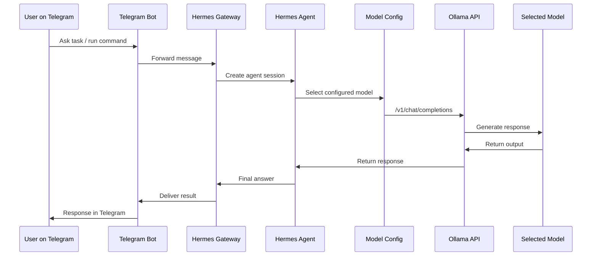

# Architecture

## Goal

Build a low-cost cloud-hosted personal agent that can be accessed from Telegram and can route different tasks to different AI models.

The project is intentionally built on a small EC2 instance to prove that the VPS is mainly an **agent orchestration layer**, not a heavyweight GPU inference server.

## Main Components

### 1. AWS EC2 VPS

The EC2 instance hosts:

- Ubuntu Server
- Hermes Agent
- Telegram gateway
- Ollama
- Local GGUF model files
- Cron/scheduled agent jobs
- Monitoring scripts

### 2. Hermes Agent

Hermes acts as the core agent runtime:

- Conversational interface
- Tool use
- Cron automation
- Messaging gateway integration
- Model-provider abstraction

### 3. Telegram Gateway

Telegram is the command surface.

Why Telegram?

- Works from phone and desktop
- Good for always-on agent notifications
- Good for scheduled output delivery
- Simple bot authorization model

Bot codename: **Team Death Eaters**.

### 4. Ollama

Ollama is the model runtime layer.

It provides:

- Local model runner
- OpenAI-compatible endpoint
- GGUF import support
- Access to cloud models such as `minimax-m3:cloud`

Default endpoint:

```text
http://127.0.0.1:11434/v1
```

### 5. Model Backends

The project uses multiple model classes:

- Local Gemma 4 E2B Q2 for cheap repetitive jobs
- Ollama Cloud `minimax-m3:cloud` for better general reasoning
- GitHub Copilot student-tier models for development tasks
- Claude Haiku / mini models for fast lightweight summarization

## Runtime Flow



## Design Principle

The EC2 instance should behave like an **operations bridge**.

It should not be overloaded with tasks that require GPU-scale inference. Heavy coding and security reasoning should route to stronger cloud models.

## Why Not Only Local Gemma?

The local Gemma 4 E2B Q2 model is useful for:

- Short reminders
- Status summaries
- Server health checks
- Simple classification
- Lightweight automation

It is weak for:

- Complex coding
- Vulnerability analysis
- Multi-step architecture decisions
- Long-context reasoning

Therefore the final architecture is hybrid.
